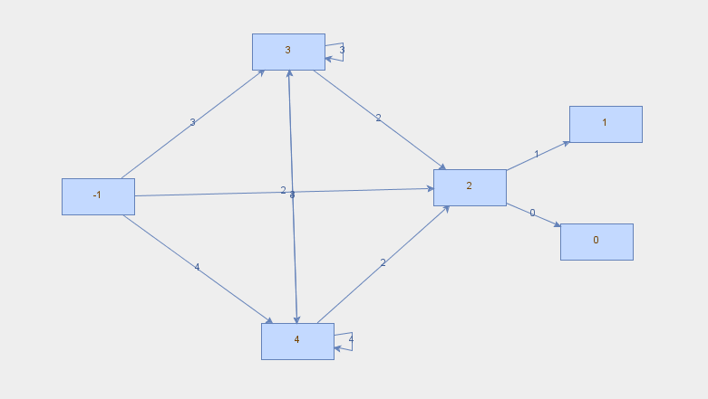

This is part of a bigger project. We implemented the Berry-Sethi algorithm to create NFA from regular expressions.

Required libraries:
* JUnit 4
* JGraph

### Example:

**regex:** (a|b)*a(a|b)

**NFA:**

